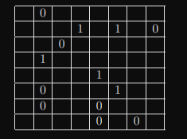
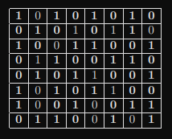

# IPASS-2022
Github repo: <https://github.com/unknownZandbak/IPASS-2022>

In deze git repo wordt alle bestanden voor mijn IPASS van 2022 geplaatst.

## Het Project

In dit project is het doel om een ai te maken die een binaire puzzel kan oplossen, door een bestaand algoritme hiervoor te implementeren.

## Binaire puzzels

Moch je nog nooit van een binaire puzzel gehoord hebben, of vergeten wat het ook alweer precies zijn dan ga zal ik het nog even uitleggen.

Een binaire puzzel is heel erg verglijk baar met een sudoku puzzel. Het zijn allebij grids(matrixen) altijd vierkant en moeten ingevuld worden met getallen.

Nou in het geval van een binaire puzzel mogen we alleen een 1 of een 0 in vullen: \

***
We hebben oon een paar regels waar we ons aan moeten houden bioj het invullen van de puzzel, deze regels worden soms ook `Constraints` genoemd.

- Constraint 1
    \
  Er mogen niet meer dan 2 de zelfde waarden direct naast elkaar zijn op de zelfde rij of kolom.

- Constrain 2
    \
    Elke rij en kolom moeten een even veel grote hoeveelheid aan `1` en `0` bevaten.

- Constrain 3
  \
  Alle rijen en kolomen moeten uniek zijn van elkaar.

Een opgeloste puzzel zou er dan als vervold uit kunnen zien.\

## Algoritme

Voor het algoritme ga ik gebruik maken van het `Backtrack_Based_Search` algoritme om schreven in de onderstaande paper.

><https://www.researchgate.net/journal/Mathematics-in-Computer-Science-1661-8289/publication/317104134_Solving_a_Binary_Puzzle/links/5fc1aed592851c933f69c1ef/Solving-a-Binary-Puzzle.pdf>

In de paper wordt dit algoritme in 2 verschillende pseudo code delen getoond, Het `Solve` gedeelte en het `Constraint Propagation` gedeelte

    Algorithm 1: Solve(B,i, j, v)
    Input: An n × n binary puzzle B, positive integers i, j with 1 ≤ i, j ≤ n, and v ∈ {0, 1}.
    1 B[i][j] ← v
    2 B	 ← ConstraintPropagation(B)
    3 if contradiction occur in B	 then
    4    return
    5 else
    6    if B	 has no empty cell then
    7       print B	
    8       return
    9    else
    10      Randomly choose x, y (1 ≤ x, y ≤ n) such that B[x][y] is an empty cell.
    11      Solve (B, x, y, 0)
    12      Solve (B, x, y, 0)
>
    Algorithm 2: ConstraintPropagation(B)
    Input: An n × n binary puzzle B.
    Output: An updated B according to all three constraints.
    1 repeat
    2   for i = 1 to n do // Fulfilling Constraint 1
    3       for j = 1 to n do
    4           if j ≤ n − 2 then
    5           if there is an empty cell in (B[i][j], B[i][j + 1], B[i][j + 2]) then
    6               Fill (B[i][j], B[i][j + 1], B[i][j + 2]) according to Constraint 1
    7           if i ≤ n − 2 then
    8               if there is an empty cells in (B[i][j], B[i + 1][j], B[i + 2][j]) then
    9                   Fill (B[i][j], B[i + 1][j], B[i + 2][j]) according to Constraint 1
    10
    11  for i = 1 to n do // Fulfilling Constraint 2
    12      if row i of B has an empty cell then
    13          Fill row i of B according to Constraint 2
    14      if column i of B has an empty cell then
    15          Fill column i of B according to Constraint 2
    16
    17  for i = 1 to n − 1 do // Fulfilling Constraint 3
    18      if row i of B has no empty cell then
    19          for j = i + 1 to n do
    20              if row j of B has an empty cell then
    21                  Fill row j of B according to Constraint 3 by comparing it with row i
    22      if column i of B has no empty cell then
    23          for j = i + 1 to n do
    24              if column j of B has an empty cell then
    25                  Fill column j of B according to Constraint 3 by comparing it with column i
    26 until B can no longer be updated
    27 return B
